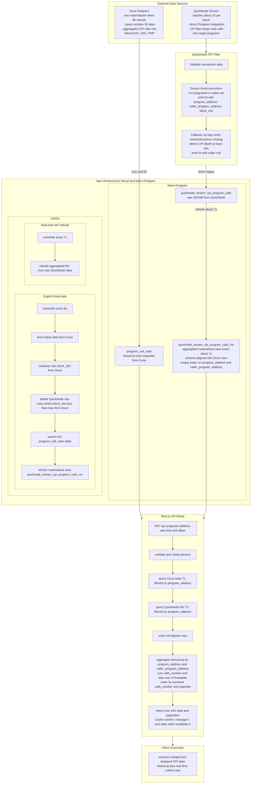

```mermaid
flowchart TD
    %% ===== CPI DATA PIPELINE =====

    subgraph S[External Data Sources]
        direction TB
        DUNE[Dune Analytics<br/>- two materialized views, 6h refresh<br/>- query window 30 days<br/>- aggregates CPI calls into Token2022, SAS, PMP]
        QN[QuickNode Stream<br/>- batches about 10 per block<br/>- direct Postgres integration<br/>- CPI filter keeps only calls into target programs]
    end

    subgraph QNF[QuickNode CPI Filter]
        direction TB
        QF1[Validate transaction data]
        QF2[Extract innerInstructions<br/>if ix.programId in callee set<br/>emit hit with program_address, caller_program_address, block_slot]
        QF3[Fallback via logs when innerInstructions missing<br/>detect CPI depth at least two<br/>emit hit with caller null]
        QF1 --> QF2 --> QF3
    end
    QN --> QNF

    subgraph APP[App Infrastructure Vercel and Neon Postgres]
        direction TB

        subgraph DB[Neon Postgres]
            direction TB
            T1[program_call_stats<br/>historical rows imported from Dune]
            T2[quicknode_stream_cpi_program_calls<br/>raw JSONB from QuickNode]
            T3[quicknode_stream_cpi_program_calls_mv<br/>aggregated materialized view every about 7s<br/>schema aligned with Dune view<br/>unique index on program_address and caller_program_address]
        end

        subgraph CRON
            subgraph DUNE_EXPORT[Export Dune data]
                direction TB
                C1[schedule every 6h]
                C2[fetch latest data from Dune]
                C3[compute max block_slot from Dune]
                C4[delete QuickNode raw rows where block_slot less than max from Dune]
                C5[upsert into program_call_stats table]
                C6[refresh materialized view quicknode_stream_cpi_program_calls_mv]
                C1 --> C2 --> C3 --> C4 --> C5 --> C6
            end

            subgraph QUCKNODE_EXPORT[Real-time MV rebuild]
                direction TB
                R1[schedule every 7s]
                R2[rebuild aggregated MV from raw QuickNode data]
                R1 --> R2
            end
        end
    end

    subgraph API[Next.js API Route]
        direction TB
        A0[GET api programs address with limit and offset]
        A1[validate and clamp params]
        A2[query Dune table T1 filtered by program_address]
        A3[query QuickNode MV T3 filtered by program_address]
        A4[union all aligned rows]
        A5[aggregate and group by program_address and caller_program_address<br/>sum calls_number and take max of metadata<br/>order by summed calls_number and paginate]
        A6[return json with data and pagination<br/>cache control s maxage 5 and stale while revalidate 2]
        A0 --> A1 --> A2 --> A3 --> A4 --> A5 --> A6
    end

    subgraph CLIENT[Client Consumer]
        CL1[receives merged and deduped CPI stats<br/>historical plus real time unified view]
    end

    DUNE -->|cron pull 6h| T1
    QNF -->|direct ingest| T2
    T2 -->|refresh about 7s| T3
    T1 --> API
    T3 --> API
    API --> CLIENT
```
