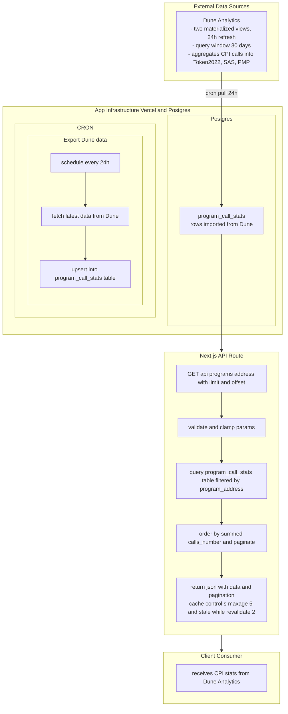

```mermaid
flowchart TD
    %% ===== CPI DATA PIPELINE =====

    subgraph S[External Data Sources]
        direction TB
        DUNE[Dune Analytics<br/>- two materialized views, 24h refresh<br/>- query window 30 days<br/>- aggregates CPI calls into Token2022, SAS, PMP]
    end

    subgraph APP[App Infrastructure Vercel and Postgres]
        direction TB

        subgraph DB[Postgres]
            direction TB
            T1[program_call_stats<br/>rows imported from Dune]
        end

        subgraph CRON
            subgraph DUNE_EXPORT[Export Dune data]
                direction TB
                C1[schedule every 24h]
                C2[fetch latest data from Dune]
                C3[upsert into program_call_stats table]
                C1 --> C2 --> C3
            end
        end
    end

    subgraph API[Next.js API Route]
        direction TB
        A0[GET api programs address with limit and offset]
        A1[validate and clamp params]
        A2[query program_call_stats table filtered by program_address]
        A3[order by summed calls_number and paginate]
        A4[return json with data and pagination<br/>cache control s maxage 5 and stale while revalidate 2]
        A0 --> A1 --> A2 --> A3 --> A4
    end

    subgraph CLIENT[Client Consumer]
        CL1[receives CPI stats from Dune Analytics]
    end

    DUNE -->|cron pull 24h| T1
    T1 --> API
    API --> CLIENT
```
