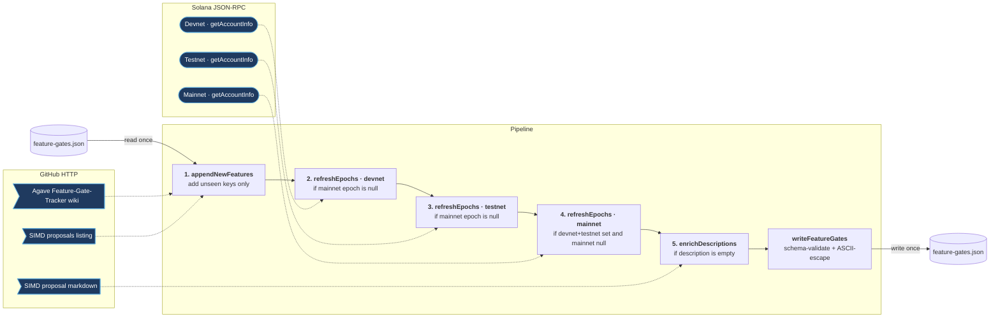

# Design: feature-gate data pipeline

This document supplements [`proposal.md`](./proposal.md) by describing how the
cron-side updater obtains and enriches feature-gate data — what each stage
reads, what it writes, and which records each stage may touch.

The normative contract (which fields update under which conditions) lives in
the [spec delta](./specs/feature-gate-data/spec.md). This document explains
the same behaviour in prose so a reviewer can audit the pipeline without
reading the code first.

## External data sources

| Source | URL pattern | Used for |
|---|---|---|
| Agave Feature-Gate-Tracker wiki | `raw.githubusercontent.com/wiki/anza-xyz/agave/Feature-Gate-Tracker-Schedule.md` | Discovering new pending features; never overwrites existing rows |
| SIMD proposals listing | GitHub API listing of `solana-foundation/solana-improvement-documents/proposals/` | Resolving `SIMD-NNNN` numbers to raw markdown URLs |
| SIMD proposal markdown | `raw.githubusercontent.com/solana-foundation/solana-improvement-documents/main/proposals/<file>.md` | First-time description back-fill |
| Devnet / Testnet / Mainnet RPC | `api.{devnet,testnet,mainnet-beta}.solana.com` (overridable via env) | On-chain activation-epoch reads |

## Pipeline

The script is one linear `pipe()` over a list of `FeatureGate[] → FeatureGate[]` stages. Each stage's external input (wiki, RPC, SIMD markdown) is shown on the right of its box; the file at the top and bottom is the same file.

The script is one linear `pipe()` over a list of `FeatureGate[] → FeatureGate[]` stages. The local file at the top and bottom is the same file (read once, written once). Solid arrows trace the data pipeline; dotted arrows are calls to external services, grouped by provider on the right.

Each numbered box is a pure `FeatureGate[] → FeatureGate[]` stage. The list is
read from disk once at the start and written back once after the last stage;
no stage mutates the input in place.

## Stage-by-stage behaviour

### 1. `appendNewFeatures(existing, scraped)`

- Reads the Agave wiki and the SIMD proposals listing.
- Parses only tables whose section heading starts with `Pending` (selection is
  by heading, not table position — an added or reordered table cannot silently
  shift which rows we pick up).
- Appends scraped features whose `key` is not already in the persisted set.
- **Existing rows are not modified.** Wiki metadata (title, SIMDs, SIMD links,
  version floors) deliberately does not flow back into already-imported
  features. The trade-off is documented in code: a failed SIMD-proposals
  lookup yields empty links, which would otherwise clobber persisted data on
  every cron run.

### 2–4. `refreshEpochs(features, field, rpcUrl, isEligible)`

Each cluster runs as one sequential pass on purpose: all three can fall back
to shared public RPCs, so parallel bursts just trip rate limits. The per-call
delay is 500 ms; 429 responses retry with exponential backoff (1s / 2s / 4s)
up to three attempts before falling back to the previously stored epoch.

Eligibility predicates control which existing rows the pass touches:

- **Devnet & testnet passes** use `stillPending`: feature's
  `mainnet_activation_epoch === null`. While a feature is in flight, its
  devnet/testnet epochs can still shift (and historical off-by-one errors can
  be healed on the next run). Once mainnet activates, both pre-mainnet epochs
  freeze and the row is skipped.
- **Mainnet pass** uses `liveButNotOnMainnet`: devnet **and** testnet are set
  **and** mainnet is null. The pass only attempts mainnet for features that
  have already shipped on both pre-mainnet clusters — the normal Solana
  promotion order. Once mainnet activates, the row is skipped on all future
  runs.

The on-chain decoder reads the feature account's first byte as the activated
flag, the next eight bytes as a little-endian `activation_slot`, then maps the
slot to an epoch via the cluster's `EpochSchedule`. Unactivated, empty, or
unreachable accounts fall back to `backupEpoch` (the previously stored value).

### 5. `enrichDescriptions(features)`

- Triggered per-feature only when `description` is currently empty
  (`!feature.description?.trim()`).
- Resolves each `simd_link[0]` from `github.com/.../blob/...` to its
  `raw.githubusercontent.com` form and fetches the markdown.
- Extracts the first paragraph of the `## Summary` section (or `## Abstract`
  as fallback), stripping markdown emphasis and front matter, truncated to
  280 characters with a trailing `…`.
- **Write-once.** Descriptions are not re-fetched after the first successful
  fill. A later edit to the SIMD doc does not propagate into the JSON — the
  trade-off is keeping daily SIMD fetches bounded and avoiding spurious diffs
  on the cron PR.

## Write-side guarantees

After the last stage, `writeFeatureGates`:

1. **Validates the in-memory list** against `FeatureGatesArraySchema`
   (superstruct). A drift in shape — a missing required field, a `null` where
   the schema expects a number — fails the script before disk is touched.
2. **Serialises with `JSON.stringify(..., null, 2)`**, then ASCII-escapes
   every non-ASCII codepoint via `escapeNonAscii` so the on-disk file stays
   pure ASCII regardless of writer. This matches the prior Python writer's
   `json.dumps(ensure_ascii=True)` form, keeping cron PR diffs limited to
   real content changes.
3. **Writes once**, appending a trailing newline.

## Per-field refresh policy

| Field | First write | Refreshes on later runs? | Stops refreshing when |
|---|---|---|---|
| `key`, `title`, `simds`, `simd_link`, `min_*_versions`, `owners`, `comms_required`, `planned_testnet_order` | On first wiki import | No (existing rows are not merged from the wiki) | n/a — write-once |
| `devnet_activation_epoch` | On first wiki import (may be set to wiki value) | Yes, re-derived on-chain | `mainnet_activation_epoch` becomes non-null |
| `testnet_activation_epoch` | On first wiki import (may be set to wiki value) | Yes, re-derived on-chain | `mainnet_activation_epoch` becomes non-null |
| `mainnet_activation_epoch` | Always `null` on first wiki import | Yes, derived on-chain | The feature activates on mainnet (field becomes non-null) |
| `description` | Empty on first wiki import | Yes — once, when currently empty | The field is non-empty |

## Trade-offs intentionally accepted

- **Historical errors on activated mainnet features are not auto-healed.** A
  one-time backfill (nulling the affected field on the affected rows and
  rerunning the pipeline) is the intended fix when a code-level decoder bug
  lands. Daily re-derivation of hundreds of frozen-on-chain values would
  multiply public-RPC traffic without producing new information.
- **Wiki edits to already-imported feature metadata do not propagate.** Same
  reason as above plus the empty-link clobber risk from a failed
  SIMD-proposals lookup; if a refinement is wanted, a future change can
  selectively merge non-empty wiki fields.
- **Descriptions can become stale relative to upstream SIMD edits.** Accepted
  in exchange for a stable cron PR diff and bounded GitHub traffic.
