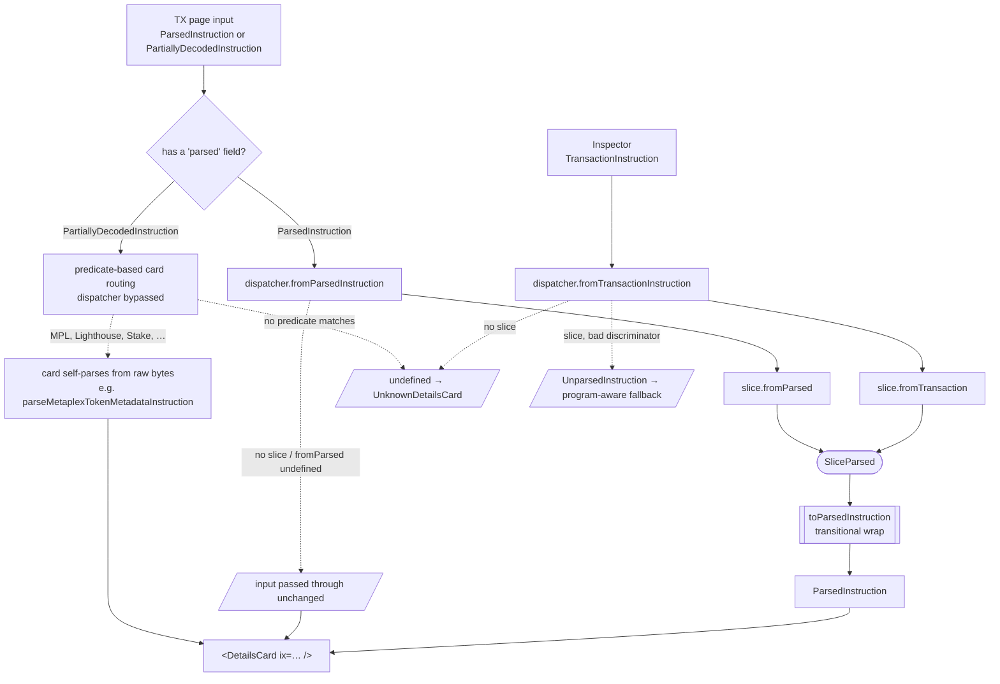

# instruction-parser

## Purpose

One normalisation layer for Solana instruction data, shared by `/tx/[signature]` and `/tx/(inspector)/inspector`. Both surfaces fold their input through the same per-program slice and render the same `*DetailsCard` components. Adding a program is one slice plus one line in the shared dispatcher; a contract test pins the two paths to the same canonical shape so they cannot silently disagree.

## Architecture

`SliceParsed` is the slice-owned canonical shape (typically a discriminated union). The compat layer at `app/entities/instruction-parser/model/compat.ts` holds every shim that lets inspector input flow through tx-page-designed cards: `toParsedInstruction` wraps `SliceParsed` back to `ParsedInstruction`, and `toParsedTransaction` builds a synthetic `ParsedTransaction` around a single instruction for cards that take a `tx` prop. Both disappear in one deletion when cards consume `SliceParsed` directly.

### Handling `ParsedInstruction | PartiallyDecodedInstruction`

The tx page's input is the union `ParsedInstruction | PartiallyDecodedInstruction` — the RPC pre-parses the programs on its allowlist into `ParsedInstruction` (with a `parsed.{type,info}`) and returns everything else as a `PartiallyDecodedInstruction` (raw `accounts` + base58 `data`, no `parsed`). The inspector has no such union; it always starts from a raw `TransactionInstruction`.

The `Inspector` node in the diagram is the convergence point for **both** of the inspector's entry modes: loading a transaction by signature (`/tx/[signature]/inspect`) and decoding a wire-format `VersionedMessage` (`/tx/inspector?message=…`). Both deserialise/decompile down to the same `TransactionInstruction`s before reaching `dispatcher.fromTransactionInstruction`, so the parsing pipeline is identical regardless of how the inspector was fed — adding or changing an inspector entry mode does not touch any slice.

The discriminant is the presence of a `parsed` field, and the tx page branches on it **before** the dispatcher (`'parsed' in ix ? dispatcher.fromParsedInstruction(ix) : undefined`):

- A **`ParsedInstruction`** goes through `dispatcher.fromParsedInstruction`, which either normalises it via a slice's `fromParsed` or passes it through unchanged.
- A **`PartiallyDecodedInstruction`** never enters the dispatcher. It falls through to the tx page's existing predicate chain (`isLighthouseInstruction`, the MPL `programId` check, Anchor/IDL, … else `UnknownDetailsCard`), and the matched card decodes it from raw bytes via the **byte path** (e.g. MPL's card calls `parseMetaplexTokenMetadataInstruction(toKitInstruction(ix))`).

So `fromParsedInstruction` is typed `(ix: ParsedInstruction)` and only ever receives a `ParsedInstruction`; it MUST NOT be called with a `PartiallyDecodedInstruction`. Programs that surface as `PartiallyDecodedInstruction` are reached only through `fromTransaction`, never by a slice reaching into a half-parsed RPC shape.

## ADDED Requirements

### Requirement: Per-program parser slices

Each supported Solana program SHALL be implemented as a feature slice at `app/features/decode-instruction-<program>/` exposing an `InstructionParser
` value, where `P extends ParsedInstructionInfo` is the slice's canonical shape. The `decode-instruction-` prefix (not bare `instruction-`) keeps these decoder slices distinct from other instruction-related features and signals that they operate on raw buffer data.

The parser SHALL set `programId` (base58) and `programLabel` matching the RPC `program` field. It SHALL implement `fromTransaction(ix: KitInstruction): P | undefined` and MAY implement `fromParsed(ix: ParsedInstruction): P | undefined`. Slice internals MUST NOT import `@solana/web3.js` types — the bridge is `KitInstruction` from `@/app/shared/lib/web3js-compat`.

Because `fromTransaction` takes a `KitInstruction` — a single decoded instruction — a slice is **agnostic to the enclosing message variant**. Whether the source was a `LegacyMessage` or a `VersionedMessage`, and whether the inspector obtained it by signature or as a wire-format message, the message is decompiled to per-instruction `TransactionInstruction`s and normalised to `KitInstruction` *before* any slice runs. No slice sees, or needs to branch on, the legacy/versioned distinction. This change therefore does **not** require migrating message decoding to `@solana/kit` wholesale — legacy and versioned messages both reduce to the same per-instruction input, so the two can be migrated independently of (and after) this change.

#### Scenario: RPC-parsed program publishes both paths

- **WHEN** a slice handles a program the RPC pre-parses (System, SPL Token, Token-2022, Associated Token)
- **THEN** the slice MUST publish both `fromTransaction` and `fromParsed`
- **AND** both paths MUST produce the same `SliceParsed` for the same logical instruction

#### Scenario: Non-RPC-parsed program omits fromParsed

- **WHEN** a slice handles a program the RPC does not pre-parse
- **THEN** the slice MUST publish only `fromTransaction`
- **AND** the dispatcher's `fromParsedInstruction` MUST pass that program's input through unchanged

### Requirement: Dispatcher contract

The entity at `app/entities/instruction-parser/` SHALL expose a factory `createInstructionParserDispatcher(parsers)` that throws on duplicate `programId`. The returned dispatcher SHALL expose:

- `canHandle(programId): boolean`
- `fromTransactionInstruction(ix): DispatchResult | undefined`
- `fromParsedInstruction(ix): ParsedInstruction`
- `getInstructionParser(programId): InstructionParser | undefined`

`canHandle` is a cheap, parse-free predicate that lets a caller decide whether to route an instruction through a slice **before** attempting a decode. It MUST be a pure registration lookup (`true` iff a slice is registered for `programId`) and MUST NOT run the parser — so it cannot become a second source of truth that drifts from what `fromTransaction`/`fromParsed` actually accept. Because every slice implements `fromTransaction` (only `fromParsed` is optional), `canHandle === true` means the byte path can decode that program; to test the RPC path specifically, inspect `getInstructionParser(programId)?.fromParsed`.

`DispatchResult` is `ParsedInstruction | UnparsedInstruction` where `UnparsedInstruction = { unknown: true; programLabel: string; programId: PublicKey }` — named as a sibling of `ParsedInstruction` so the union reads as two parallel outcomes of one decode attempt (a successfully parsed instruction, or one whose program is known but whose discriminator the slice could not decode), not two unrelated shapes. The dispatcher MUST be pure and MUST NOT hold module-level state. It is delivered to consumers via `InstructionParserProvider` / `useInstructionParser`; the hook MUST throw when used outside the provider.

#### Scenario: canHandle reflects registration only

- **WHEN** `canHandle(programId)` is called
- **THEN** it MUST return `true` iff a slice is registered for that `programId`
- **AND** it MUST NOT invoke `fromTransaction` or `fromParsed` (no allocation, no superstruct validation)

#### Scenario: No parser registered

- **WHEN** `fromTransactionInstruction(ix)` is called for a program with no registered parser
- **THEN** the dispatcher MUST return `undefined`
- **AND** callers MUST treat that as "render `UnknownDetailsCard`"

#### Scenario: Parser exists, discriminator unknown

- **WHEN** the registered parser's `fromTransaction` returns `undefined`
- **THEN** the dispatcher MUST return `{ unknown: true, programLabel, programId }`
- **AND** callers MAY branch on `programLabel` to render a program-aware fallback card (e.g. MPL's "Unknown Instruction")

#### Scenario: fromParsedInstruction passes unknown input through

- **WHEN** `fromParsedInstruction(ix)` is called for a program with no slice, or the slice's `fromParsed` returns `undefined`
- **THEN** the dispatcher MUST return the input reference-equal to what was passed in

### Requirement: Single shared dispatcher

Every page that renders instruction cards SHALL consume the dispatcher exported from `app/tx/instruction-parser-dispatcher.ts`. The provider is wrapped once in `app/tx/layout.tsx` (the common ancestor of `/tx/[signature]`, `/tx/inspector`, and `/tx/[signature]/inspect`) via the `TxInstructionParserProvider` client component, so every `/tx` route inherits it and no page wraps its own. Routes needing a different parser set MUST compose their own via `createInstructionParserDispatcher` rather than mutating the shared list.

#### Scenario: Adding a new program

- **WHEN** a new program slice is added under `app/features/decode-instruction-*/`
- **THEN** its parser is appended to the shared dispatcher's `parsers` list
- **AND** every `/tx` route picks up the new program through the layout provider with no further changes

#### Scenario: Adding a new /tx route

- **WHEN** a new page under `/tx` renders instruction cards
- **THEN** it inherits the dispatcher from `app/tx/layout.tsx` automatically
- **AND** it MUST NOT need its own `<InstructionParserProvider>` wrap

### Requirement: Compat layer is transitional

The compat shims at `app/entities/instruction-parser/model/compat.ts` SHALL be the only place that adapts inspector input to the tx-page card prop shape. `toParsedInstruction` is the only permitted bridge from `SliceParsed` to `ParsedInstruction`; `toParsedTransaction` is the only permitted way to build a synthetic `ParsedTransaction` around a single instruction. New compat shims of this kind MUST live in the same file. When cards migrate to consume `SliceParsed` directly, the whole file MUST be deleted together with its call sites.

#### Scenario: Dispatcher routes through the shared wrap

- **WHEN** the dispatcher produces a `ParsedInstruction` for a successfully decoded slice output
- **THEN** the wrap MUST come from `toParsedInstruction`, not be inlined inside the dispatcher
- **AND** removing `toParsedInstruction` MUST require updating only the dispatcher and the cards that consume `SliceParsed` directly

#### Scenario: Inspector synthetic tx comes from the compat layer

- **WHEN** the inspector renders a card that takes a `tx: ParsedTransaction` prop
- **THEN** the tx MUST be built via `toParsedTransaction` from the compat layer
- **AND** no other module in the codebase MUST fabricate a synthetic `ParsedTransaction`

### Requirement: No input mutation

The dispatcher and every slice parser MUST NOT mutate the input `TransactionInstruction` or `ParsedInstruction`. `toKitInstruction` MUST return a fresh object. The Associated Token discriminator workaround MUST construct a local `Uint8Array` via `{ ...ix, data: effective }` rather than writing to `ix.data`.

> Enforcement. The binding guarantee is the runtime check — the "snapshot before/after" scenario below, plus per-slice mutation tests (e.g. the Associated Token "should not mutate the input instruction.data" test) — which asserts the input object graph is unchanged after a call. Static typing only partially helps: `KitInstruction.data` is intentionally typed `Uint8Array`, **not** `ReadonlyUint8Array`, because some kit parsers (e.g. lighthouse) require the mutable type (see `app/shared/lib/web3js-compat.ts`), so a read-only `data` is not viable as a guard. The `no-param-reassign` ESLint rule with `{ "props": true }` MAY be enabled for the slice files as an extra guardrail against `ix.data = …` reassignment, but it is not currently configured and would not catch in-place element writes (`ix.data[0] = …`) — which is precisely why the Associated Token workaround builds a fresh `Uint8Array` (`{ ...ix, data: effective }`) and the runtime snapshot test is the real backstop.

#### Scenario: Dispatch leaves input untouched

- **WHEN** a slice parser or the dispatcher processes an instruction
- **THEN** the input object graph MUST be unchanged after the call
- **AND** snapshot comparisons before and after MUST find no difference

### Requirement: Cross-pipeline equivalence

A contract test SHALL assert, for every program with both `fromTransaction` and `fromParsed`, that the two paths produce equivalent field values for the same logical instruction. The test lives at `app/tx/__tests__/instruction-parser-contract.spec.ts` (the composition layer, so it may import feature slices without crossing the FSD entity→feature boundary) and MUST extend for every new slice that publishes both paths.

The assertion takes one of two shapes depending on whether the two paths share an output shape:

- **Same-validator parity** — when the byte path normalises into the RPC-info shape (System, SPL Token, the Token-2022 metadata/pointer/group extensions), both payloads are validated by the *same* superstruct and compared field-for-field.
- **Mapped parity** — when the byte path emits a structurally different shape (Associated Token's byte path returns `@solana-program/token` kit objects with a named `accounts` map, while the RPC path emits a flat `*Info` struct), the test maps between the two field namings (e.g. `accounts.payer` ↔ `source`) and asserts the addresses agree. This still guards account ordering and field mapping — the class of latent bug the migration fixed.

The only slice with no parity test is MPL Token Metadata, by necessity: the RPC never pre-parses it, so it has no `fromParsed` path to compare against.

> Caveat — known divergences. The two representations do not always carry the same information. The RPC `parsed.info` can differ from a local byte decode in cases such as multisig instructions (the RPC may surface resolved signer sets the wire bytes only reference by index) and any instruction whose RPC shape includes data the raw bytes do not. Where a field genuinely cannot agree across the two paths, the contract test SHALL assert equivalence only on the fields that *can* agree and MUST document the divergent field with a comment, rather than forcing both shapes into a single validator.

#### Scenario: System Transfer parity (same-validator)

- **WHEN** the same `SystemProgram.transfer(...)` is dispatched via `fromTransactionInstruction(rawIx)` and `fromParsedInstruction(rpcIx)`
- **THEN** both `parsed.info` payloads MUST satisfy `TransferInfo`
- **AND** the validated `source`, `destination`, and `lamports` MUST be equal across the two paths

#### Scenario: Associated Token createIdempotent parity (mapped)

- **WHEN** the same createIdempotent instruction is dispatched via both paths
- **THEN** the byte path's `accounts.{payer,ata,owner,mint}` MUST map to the RPC path's `{source,account,wallet,mint}`
- **AND** the mapped addresses MUST be equal across the two paths

### Requirement: Program identifiers

Routing is keyed on `programId` (base58), which MUST be the canonical on-chain program address. `programLabel` is a *different* identifier: it is the RPC `parsed.program` discriminator string (e.g. `'system'`, `'spl-token'`, `'spl-token-2022'`, `'spl-associated-token-account'`), used by `fromParsed` to guard against mismatched RPC input (`if (ix.program !== 'spl-token') return undefined`). `programLabel` is therefore **not** the human-readable display name in `app/utils/programs.ts` (`PROGRAM_INFO_BY_ID`) or returned by `getProgramName()` in `app/utils/tx.ts` — those are titles like `System Program` / `Token Program`, which the slice never sets.

`programLabel` MUST be typed against the `ParserProgramLabel` union (`app/utils/programs.ts`), not bare `string`, so a slice declaring an unlisted label fails to compile. Each RPC-pre-parsed slice MUST single-source its label: the client's `programLabel` and the parser's `fromParsed` guard (`if (ix.program !== <LABEL>)`) MUST reference one exported constant, so the declared label and the guarded value cannot drift. `ParserProgramLabel` is deliberately distinct from `PROGRAM_NAMES` (those are display titles like `'Token Program'`); for programs the RPC does not pre-parse it carries a stable synthetic label.

#### Scenario: Slice label is compile-checked and single-sourced

- **WHEN** a slice declares `programLabel`
- **THEN** the value MUST be a member of `ParserProgramLabel` (a non-member is a type error)
- **AND** for RPC-pre-parsed slices the same exported constant MUST back both the `programLabel` field and the `fromParsed` program guard

#### Scenario: Slice guards fromParsed on the RPC program field

- **WHEN** a slice declares `programLabel: '<rpc-program>'` and implements `fromParsed`
- **THEN** `fromParsed` MUST return `undefined` when `ix.program !== programLabel`
- **AND** `programId` (not `programLabel`) MUST be the base58 address the dispatcher routes on

### Requirement: Cards consume pre-parsed slice output

A `*DetailsCard` whose program has a registered slice parser MUST consume the dispatcher's already-parsed output rather than re-parsing the raw instruction. `MetaplexTokenMetadataDetailsCard` MUST accept an optional `parsedIx` prop; when provided with a non-empty `parsed.type`, the card MUST reuse it and skip its internal parse.

Cards whose program has **no** registered slice (the majority today — Stake, Vote, ALT, Memo, Lighthouse, SAS, Anchor/IDL, …) are unaffected by this change: `fromParsedInstruction` passes their input through unchanged and they continue to render exactly as before. This requirement governs only the cards whose program *does* have a slice; it does not require every card to gain a slice.

#### Scenario: Card with no registered slice is unchanged

- **WHEN** the dispatcher processes an instruction for a program with no registered slice
- **THEN** `fromParsedInstruction` MUST return the input unchanged and the existing `*DetailsCard` MUST render from it as it did before this change
- **AND** no new slice or `parsedIx` prop is required for that card

#### Scenario: Inspector renders MPL without double-parse

- **WHEN** the inspector routes an MPL instruction to the card with `parsedIx` set
- **THEN** the card MUST reuse `parsedIx.parsed.{type, info}`
- **AND** the card MUST NOT call `parseMetaplexTokenMetadataInstruction` again in the same render

#### Scenario: Tx-page predicate path self-parses

- **WHEN** the tx-page predicate branch routes a `PartiallyDecodedInstruction` to the MPL card without `parsedIx`
- **THEN** the card MUST parse internally via `parseMetaplexTokenMetadataInstruction(toKitInstruction(ix))`
