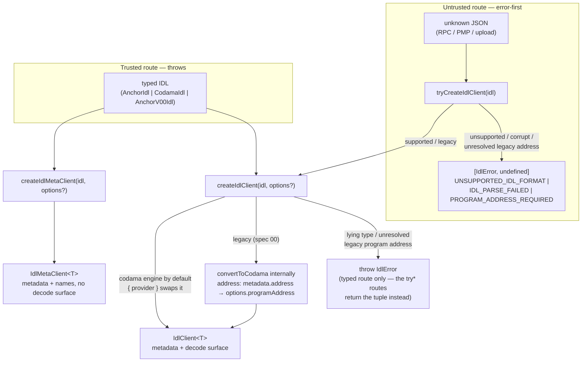
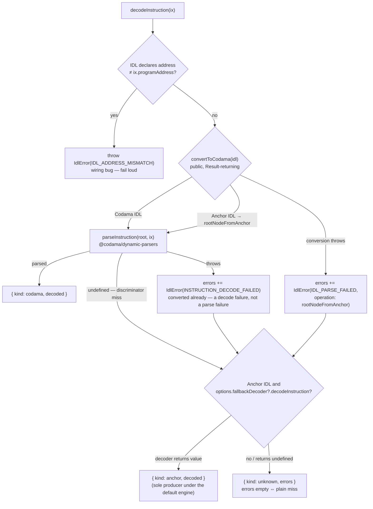

# @explorer/idl-decode — Design

One typed, standard-aware client over a program IDL: modern Anchor (>= 0.30) and Codama roots decode
through a single pipeline; legacy pre-0.30 Anchor converts at creation (program address required).
Decode results are discriminated unions narrowed statically per standard — a Codama client cannot
even express an anchor-arm handler. The README documents the consumer API; this file records the
shape and the WHY.

## Client flow

Construction — untrusted input goes error-first, typed input throws; both land on the same client:

Instruction decode — the default codama engine; under it the anchor arm exists only via the injected escape hatch:

`decodeAccount(data)` runs the same pipeline (`parseAccountData`, no address check, same escape hatch).
Handler maps are total by type; a runtime miss throws `MISSING_DECODE_HANDLER` — the bypassed-types tripwire.
`getDecodedData` asymmetry: the codama arm yields the engine result's `data`, the anchor arm the injected decoder's whole value.

## Decisions

- **Codama-normalized single pipeline** — anchor converts (`@codama/nodes-from-anchor`), one engine (`@codama/dynamic-parsers`) decodes everything; two engines would be double maintenance for the same bytes.
- **Anchor arm = escape hatch only** — under the default codama engine the injected `fallbackDecoder` is the sole producer of `{ kind: anchor }` (a swapped provider may return it directly); its payload stays `unknown` so consumers never couple to a library guess; bypassed pipeline errors survive in `recoveredFrom`.
- **Legacy pre-0.30 converts at creation** — recognized (`isLegacyAnchorIdl`), normalized internally via `convertToCodama` (nodes-from-anchor handles both specs) into a codama client; the program address must resolve (IDL `metadata.address` → `options.programAddress` → typed `PROGRAM_ADDRESS_REQUIRED`) because real `anchor build` 0.29 output declares none. Consumer-owned decoders remain for IDLs conversion cannot handle.
- **Errors are values** — error-first `Result` tuples; decode failures ride the `unknown` arm as coded `IdlError`s (plain miss ⇔ `errors: []`); codes follow `@codama/errors`: stable numbers, typed context, throws split by pipeline stage.
- **Guards over a `standard` field** — `isAnchorStandard`/`isCodamaStandard` narrow the client; a string field invites untyped branching.
- **Codama payloads typed from the engine** — `NonNullable<ReturnType<typeof parseInstruction>>`, never a hand-maintained mirror.
- **Default engine rides the main entry** — ease of use over an engine-free core; the trade: every main-entry consumer loads the codama pipeline. Names-only consumers get `createIdlMetaClient` instead.
- **Heavy machinery behind subpaths** (`./fetch`, `./anchor`, `./codama`) — an entry earns its keep only when it guards a dependency subtree some real consumer profile must never load; tree-shaking alone does not protect plain-Node ESM consumers.
- **Parsed-data only** — rendering, hooks, ErrorBoundaries are consumer layers; unknown programs render by schema node (`getDecodedEntries`), never by value shape.
- **Real-artifact tests** — fixture programs build genuine IDLs (sha256-true discriminators) and mainnet snapshots are committed; CI never invokes the Rust/Anchor toolchain (regeneration is manual — DEVELOPMENT.md).

## Non-Goals

- IDL sources beyond the two on-chain legs (PMP `idl` metadata, Anchor IDL PDA) — registries and caches plug in as consumer-supplied fetchers.
- The Anchor-rich decode path (events, nested account groups) — a future seam, not this core.
