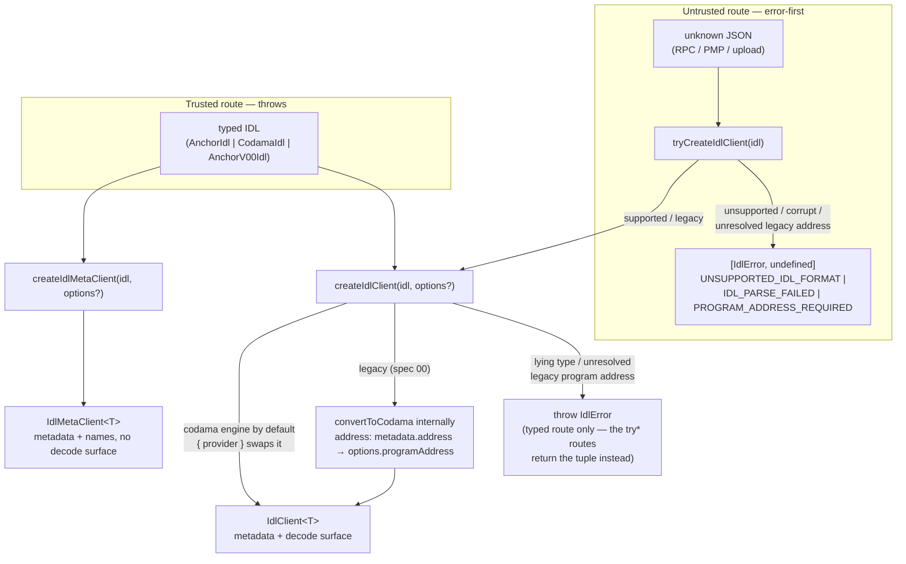
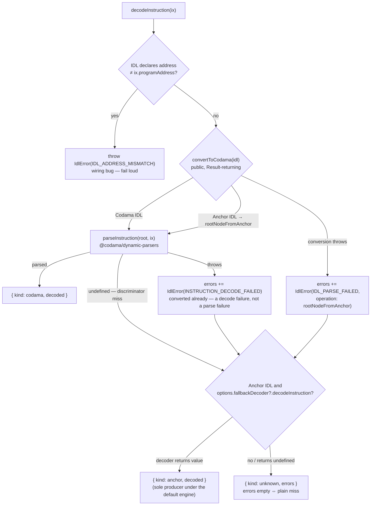

# @explorer/idl-decode — Design

One typed, standard-aware client over a program IDL: modern Anchor (>= 0.30) and Codama roots decode
through a single pipeline; legacy pre-0.30 Anchor converts at creation (program address required).
Decode results are discriminated unions narrowed statically per standard — a Codama client cannot
even express an anchor-arm handler. The README documents the consumer API; this file records what the
package models, how it parses, and how much of a payload a type can know.

## Entities

- **IDL standards** — `CodamaIdl` (a root node), `AnchorIdl` (spec 0.1.0+), `AnchorV00Idl` (pre-0.30).
  Only the first two are decode standards; the third is a shape recognized to be converted away.
- **Clients** — `IdlClient` carries metadata plus the decode surface, `IdlMetaClient` metadata and
  names alone (decode methods are statically absent, not stubbed).
- **Decodable units** — an instruction and an account, same pipeline. Only the instruction is address
  checked: it names the program it was sent to, an account's bytes do not.
- **Decode results** — a union discriminated by the standard that produced the payload (`codama`,
  `anchor`, `unknown`). Which arms a client's type carries follows the IDL it was built from.
- **Schema nodes** — every decode carries the `InstructionNode` / `AccountNode` it matched, so what a
  type could not describe is still available as data.

## Client flow

Construction — untrusted input goes error-first, typed input throws; both land on the same client:

```mermaid
flowchart TD
    subgraph UNTRUSTED["Untrusted route — error-first"]
        RAW["unknown JSON<br/>(RPC / PMP / upload)"] --> TRY["tryCreateIdlClient(idl)"]
        TRY -->|"unsupported / corrupt /<br/>unresolved legacy address"| ERR["[IdlError, undefined]<br/>UNSUPPORTED_IDL_FORMAT |<br/>IDL_PARSE_FAILED | PROGRAM_ADDRESS_REQUIRED"]
    end
    subgraph TRUSTED["Trusted route — throws"]
        TYPED["typed IDL<br/>(AnchorIdl | CodamaIdl | AnchorV00Idl)"]
    end
    TRY -->|"supported / legacy"| CREATE["createIdlClient(idl, options?)"]
    TYPED --> CREATE
    CREATE -->|"lying type / unresolved<br/>legacy program address"| THROW["throw IdlError<br/>(typed route only — the try* routes<br/>return the tuple instead)"]
    CREATE -->|"legacy (spec 00)"| CONVERT["convertToCodama internally<br/>address: metadata.address → options.programAddress"]
    CONVERT --> CLIENT
    CREATE -->|"codama engine by default<br/>{ provider } swaps it"| CLIENT["IdlClient&lt;T&gt;<br/>metadata + decode surface"]
    TYPED --> METACREATE["createIdlMetaClient(idl, options?)"]
    METACREATE --> META["IdlMetaClient&lt;T&gt;<br/>metadata + names, no decode surface"]
```

Instruction decode — the default codama engine; under it the anchor arm exists only via the injected escape hatch:

```mermaid
flowchart TD
    IX["decodeInstruction(ix)"] --> ADDR{"IDL declares address<br/>≠ ix.programAddress?"}
    ADDR -->|yes| MISMATCH["throw IdlError(IDL_ADDRESS_MISMATCH)<br/>wiring bug — fail loud"]
    ADDR -->|no| ROOT{"convertToCodama(idl)<br/>public, Result-returning"}
    ROOT -->|"Codama IDL"| PARSE
    ROOT -->|"Anchor IDL → rootNodeFromAnchor"| PARSE["parseInstruction(root, ix)<br/>@codama/dynamic-parsers"]
    ROOT -->|"conversion throws"| COLLECT["errors += IdlError(IDL_PARSE_FAILED,<br/>operation: rootNodeFromAnchor)"]
    PARSE -->|"parsed"| CODAMA["{ kind: codama, decoded }"]
    PARSE -->|"undefined — discriminator miss"| FALLBACK
    PARSE -->|"throws"| COLLECT2["errors += IdlError(INSTRUCTION_DECODE_FAILED)<br/>converted already — a decode failure, not a parse failure"]
    COLLECT --> FALLBACK{"Anchor IDL and<br/>options.fallbackDecoder?.decodeInstruction?"}
    COLLECT2 --> FALLBACK
    FALLBACK -->|"decoder returns value"| ANCHOR["{ kind: anchor, decoded }<br/>(sole producer under the default engine)"]
    FALLBACK -->|"no / returns undefined"| UNKNOWN["{ kind: unknown, errors }<br/>errors empty ⇔ plain miss"]
```

`decodeAccount(data)` runs the same pipeline (`parseAccountData`, no address check, same escape hatch).
Handler maps are total by type; a runtime miss throws `MISSING_DECODE_HANDLER` — the bypassed-types tripwire.
`getDecodedData` asymmetry: the codama arm yields the engine result's `data`, the anchor arm the injected decoder's whole value.

## Parsing

- **Codama-normalized single pipeline** — anchor converts (`@codama/nodes-from-anchor`), one engine (`@codama/dynamic-parsers`) decodes everything; two engines would be double maintenance for the same bytes.
- **Anchor arm = escape hatch only** — under the default codama engine the injected `fallbackDecoder` is the sole producer of `{ kind: anchor }` (a swapped provider may return it directly); its payload stays `unknown` so consumers never couple to a library guess; bypassed pipeline errors survive in `recoveredFrom`.
- **Legacy pre-0.30 converts at creation** — recognized (`isLegacyAnchorIdl`), normalized internally via `convertToCodama` (nodes-from-anchor handles both specs) into a codama client; the program address must resolve (IDL `metadata.address` → `options.programAddress` → typed `PROGRAM_ADDRESS_REQUIRED`) because real `anchor build` 0.29 output declares none. Consumer-owned decoders remain for IDLs conversion cannot handle.
- **A miss is not a failure** — a discriminator that matches nothing lands on the `unknown` arm with `errors: []`, which is why a decode-shaped absence never reads as a broken IDL.
- **Errors are values** — error-first `Result` tuples; decode failures ride the `unknown` arm as coded `IdlError`s; codes follow `@codama/errors`: stable numbers, typed context, throws split by pipeline stage.
- **Guards over a `standard` field** — `isAnchorStandard`/`isCodamaStandard` narrow the client; a string field invites untyped branching.
- **Parsed-data only** — rendering, hooks, ErrorBoundaries are consumer layers; unknown programs render by schema node (`getDecodedEntries`), never by value shape.

## Inference

How much of a payload a type can know depends on the IDL's standard and on **when** the program is
known — a literal IDL in TS source, or wide JSON that only exists at runtime.

- **Literals infer, wide roots do not** — a Codama root as TS source (`as const`) IS the payload type: the matched instruction's arguments are read straight off the schema, zero generics. A fetched root widens to `CodamaIdl`, so payloads are `unknown` and a per-call generic is a caller's assertion, not a derivation. JSON imports widen the same way, which is what makes the build-time route require TS source rather than a `.json`.
- **Inferred types mirror what the parser returns, not the on-chain layout** — bytes surface as an `[encoding, data]` tuple, pubkeys as base58 `string` (not branded `Address`), `Option<T>` as kit's `{ __option }`, a scalar enum as its variant index, u64/u128 as `bigint`. `AccountsDataOf` keys those payloads by account name and doubles as the reference for that mapping; `AsDecoded<T>` projects a renderers-js codec type onto the same view.
- **Payload types come from the engine** — `NonNullable<ReturnType<typeof parseInstruction>>`, never a hand-maintained mirror, so an engine change surfaces as a type error instead of a lie.
- **The anchor arm stays `unknown` by construction** — its value comes from a consumer's decoder; naming a shape there would type someone else's guess.
- **What no type can describe arrives as schema** — the matched node travels with every decode, and `getDecodedEntries` flattens it into `{ path, node, value }` rows (links resolved, size wrappers penetrated, options unwrapped, nesting dotted), so rendering dispatches on `node.kind`. An anchor IDL's leaves pair with codama nodes through the same conversion, so one schema-driven consumer serves both standards.

## Resolution

Where an IDL comes from, once no caller hands one over.

- **One fetch implementation, two shells** — `fetchOnChainIdlClient` resolves the publications and attributes the winner (`source`, plus the PMP `authority`); `fetchIdlClient` is it with the envelope dropped, and owns the consumer-`fetcher` route, which can attribute nothing. Both run the same error contract (abort rejects with its reason · a leg's coded error passes through · any other throw is `IDL_FETCH_FAILED` · nothing resolved is `IDL_NOT_FOUND`), stated once and generic over what a step resolves. The one deliberate throw: a `programAddress` that is not an address fails on the on-chain route (no lookup derives from it — a caller bug, not a data outcome), while a consumer's fetcher receives it unchecked.
- **`IdlSource` is upstream's vocabulary, passed through** — `'pmp' | 'anchor'`, read off the result rather than re-derived from which leg was called, so the two cannot disagree and a value `@solana/idl` adds fails to compile instead of drifting. It names the publication, never the format (PMP content is often Anchor-format — that axis is `IdlStandard`). Canonical-vs-fallback stays on `authority` rather than becoming a source variant: the fndn list is an array, and a label would discard which key actually served the IDL. Consumers translate — the MCP's `pmp` / `anchor` are its wire names, not ours, and canonical-vs-fallback rides on `authority` there too.
- **Own leg ordering over `@solana/idl`'s `fetchIdlWrapped`** — each leg IS the package (`fetchPmpIdl`: canonical PDA → fndn fallback authority; `fetchAnchorIdl`); only the policy for "PMP did not resolve" is ours, and that is where the wrapper diverges twice: it cannot be told to skip the Anchor leg (native programs must not read the derived PDA at all — some RPCs answer a transient error there instead of `null`, turning "no IDL" into a retryable failure), and a valid Anchor IDL there masks a corrupt PMP one. One ordered-leg loop keeps both guarantees for ~10 lines.
- **Upstream's classification, mapped rather than reinvented** — `@solana/idl` owns the account reads and the delegated payload download, so its `IdlDecodeReason` is what our codes are derived from; we do not sniff error shapes or re-fetch to second-guess it. `framing` is a fact about the account (it is not an IDL container) → `IDL_PARSE_FAILED`; on the resolved PMP leg `payload` is upstream's catch-all for every non-`SolanaError` throw — unreachable RPC, failed url download, garbage compressed bytes alike — → `IDL_FETCH_FAILED`, because between "retry" and "this program's IDL is invalid" only the first is safe to assert about a cell that ambiguous. The anchor and buffer legs pass no such flag: upstream catches nothing there, so both their reasons are byte facts. Known cost: undecodable *direct* PMP bytes read as `source_unavailable` rather than `idl_invalid`.
- **A cause travels with the error, so consumers scrub at their boundary** — a transport `cause` can carry the key-bearing rpc endpoint (Node's `fetch` puts the whole url in `Failed to parse URL from …`). The package attaches it because a consumer may need it; every consumer that logs or serializes must reduce an `IdlError` to its own `code`/`message`, which are built only from our codes, addresses and leg names. The MCP does both — `sanitizeToolError` on the wire, coded fields only in the log.
- **A buffer is another account to read, not another source** — `buffer` names one PMP or Anchor account (an IDL staged by `anchor idl write-buffer` / PMP `write` before `setData`, or the committed one); `@solana/idl` dispatches on its owner, so `IdlSource` gains no variants and `anchor`/`authority` are type-excluded with it rather than accepted and ignored. Which account served the IDL rides on `address`, reported by every on-chain route. Known cost: a buffer failure's `operation` label still names the publication (`anchor idl data`), with no hint the read was a buffer.

## Non-Goals

- IDL sources beyond the two on-chain publications (PMP `idl` metadata, Anchor IDL PDA — derived, or read from a named buffer) — registries and caches plug in as consumer-supplied fetchers.
- The Anchor-rich decode path (events, nested account groups) — a future seam, not this core.
