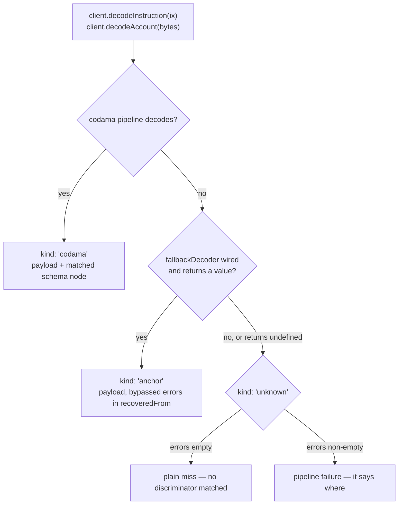

# @explorer/idl-decode

One small client over Solana program IDLs: detection, names, and decoding, regardless of which
standard produced the IDL.

What creation accepts:

- _Anchor_ — modern IDLs (`metadata.spec`), emitted by `anchor build` since 0.30
- _Codama_ — root nodes, as the program-metadata program (PMP) stores them
- _Legacy Anchor_ — pre-0.30 IDLs, converted internally at creation; the program address must resolve
  from the IDL's `metadata.address` or `options.programAddress`, else
  `IDL_ERROR__PROGRAM_ADDRESS_REQUIRED`
- anything else — `IDL_ERROR__UNSUPPORTED_IDL_FORMAT`

## Entries

Every entry is side-effect-free and tree-shakeable (gated).

| Import                        | Ships                                                                             |
| ----------------------------- | --------------------------------------------------------------------------------- |
| `@explorer/idl-decode`        | client (codama decode engine by default), guards, names, errors, types             |
| `@explorer/idl-decode/codama` | the codama engine pieces (`codamaProvider`, decode functions) for explicit wiring  |
| `@explorer/idl-decode/anchor` | Anchor IDL helpers (`convertToCodama`)                                             |
| `@explorer/idl-decode/fetch`  | fetch the IDL by program address (`fetchIdlClient`)                                |

## Quick start

`tryCreate*` never throws on untrusted JSON — it returns an error-first tuple. Branch on the `error`,
or throw it if you prefer exceptions.

```ts
import { isCodamaStandard, isIdlError, IDL_ERROR__UNSUPPORTED_IDL_FORMAT, tryCreateIdlClient } from '@explorer/idl-decode';

const [error, client] = tryCreateIdlClient(fetchedJson);
if (error) throw error; // code-discriminated: isIdlError(error, IDL_ERROR__UNSUPPORTED_IDL_FORMAT)

client.programName(); // 'Token'
client.programAddress(); // 'TokenkegQfeZyiNwAJbNbGKPFXCWuBvf9Ss623VQ5DA'
client.instructionName(instructionData); // 'Transfer'
isCodamaStandard(client); // narrows the client to one standard
```

## Names-only client

`createIdlMetaClient` returns a metadata client — decode methods are statically absent
(`tryCreateIdlMetaClient` is its error-first mirror for untrusted input):

```ts
import { createIdlMetaClient, type IdlMetaClient } from '@explorer/idl-decode';

// names and metadata only — decode methods do not exist on the type
const meta: IdlMetaClient = createIdlMetaClient(idl);

meta.programName(); // 'Token' — undefined if the IDL declares none
meta.programAddress(); // 'TokenkegQfeZyiNwAJbNbGKPFXCWuBvf9Ss623VQ5DA'
meta.programVersion(); // '3.3.0' — the program's own semver, undefined if absent
meta.formatVersion(); // Codama root version, or Anchor's metadata.spec
```

`instructionName` resolves a name from instruction data alone — a longest-prefix match against the
IDL's discriminators, no decode engine needed:

```ts
meta.instructionName(instruction.data); // 'Transfer' — undefined when no discriminator matches
```

## Decoding client

`createIdlClient` decodes with the codama engine by default; `provider` swaps in another one through
the same client surface:

```ts
import { createIdlClient, type IdlClient } from '@explorer/idl-decode';
import { codamaProvider } from '@explorer/idl-decode/codama';

const client: IdlClient = createIdlClient(idl);
const same: IdlClient = createIdlClient(idl, { provider: codamaProvider() }); // the explicit form of the default
```

## Decode arms

`decodeInstruction` and `decodeAccount` return a result discriminated by the standard that produced
the decode. Every outcome is a value — the arms are how a miss and a pipeline failure stay
distinguishable:



- the unknown arm carries that distinction as a value: `errors: []` is a miss, a non-empty
  `IdlError[]` is a failure
- the `anchor` arm exists on the type only for a raw Anchor IDL client, and fires only on a
  `fallbackDecoder` rescue — a Codama-root client (native or converted) narrows it away

Four ways to read a decode:

- `decodeInstructionData` / `decodeAccountData` — one step, error-first tuple, no arms to handle
- `unwrap(decode)` — narrows to the codama arm and surfaces payload plus matched node; any other arm
  throws `IDL_ERROR__DECODE_KIND_MISMATCH`
- `decode.kind` — branch on the union yourself, keeping miss and failure as values
- a handler map — exhaustive over the arms the client's type carries

```ts
import { createIdlClient, IdlStandard, unwrap } from '@explorer/idl-decode';

const client = createIdlClient(idl);
const decode = client.decodeInstruction(instruction); // a @solana/kit Instruction

const { data, node } = unwrap(decode); // payload + the matched InstructionNode

if (decode.kind === IdlStandard.Codama) {
    const args = client.getDecodedData<{ amount: bigint }>(decode); // u64 → bigint, pubkey → base58 string
}

const args = client.decodeInstruction(instruction, {
    codama: decode => client.getDecodedData<{ amount: bigint }>(decode),
    unknown: () => undefined,
});
```

Accounts take the same shape, the same `unwrap`, and the same handler map:

```ts
const { data, node } = unwrap(client.decodeAccount(accountData)); // payload + the matched AccountNode

const summary = client.decodeAccount(accountData, {
    codama: decode => client.getDecodedData<{ authority: string }>(decode),
    unknown: () => undefined,
});
```

One deliberate throw remains on the two-step route: an instruction whose `programAddress` differs
from the IDL's declared address is a wiring bug, not data — `IDL_ERROR__IDL_ADDRESS_MISMATCH`. The
one-step routes return it as the error value instead.

## Typed payloads — when knowledge exists

Two axes decide what the decode routes can type: the IDL's standard, and when you know the program.

|            | build time — the IDL is TS source (`as const`)                                                | runtime — only fetched JSON exists                            |
| ---------- | --------------------------------------------------------------------------------------------- | ------------------------------------------------------------- |
| **Codama** | payloads infer off the schema, zero generics                                                  | payloads type as `unknown`; the decode carries the exact node  |
| **Anchor** | pair anchor's satellite type, or convert to a codama root at build time for the full inference | same as Codama — the node is created from the JSON internally  |

JSON imports widen and lose inference, so the build-time column needs TS source. Every sample below
is executable: [`__tests__/readme-flows.integration.spec.ts`](./__tests__/readme-flows.integration.spec.ts)
runs them with type assertions.

### Codama IDLs · build time

**The schema is the type source — zero generics.** The RootNode TS variant may be shipped by the
program, or built in advance (run the anchor→codama conversion at build time and save the result):

```ts
import { createIdlClient } from '@explorer/idl-decode';
import { vaultIdl } from './idl/vault'; // `as const` root node — the IDL IS the type

const client = createIdlClient(vaultIdl);

const [, data] = client.decodeInstructionData(instruction);
//        ^? { amount: bigint; discriminator: number } | undefined — read off the schema's `deposit` instruction
```

**Pick account payloads by name.** `AccountsDataOf` keys the inferred payloads by account name — and
doubles as the decode-shape reference, because inferred types mirror what the parser _returns_, not
the on-chain layout:

```ts
import type { AccountsDataOf } from '@explorer/idl-decode';

type ConfigAccount = AccountsDataOf<typeof nttIdl>['config'];
//   ^? {
//        discriminator: [string, string]; // bytes → [encoding, data] tuple, NOT Uint8Array
//        owner: string;                   // Address/pubkey → plain base58 string, NOT a branded Address
//        pendingOwner:                    // Option<pubkey> → kit {__option} object, NOT `string | null`
//            | { __option: 'None' }
//            | { __option: 'Some'; value: string };
//        mode: number;                    // scalar enum → its variant INDEX, NOT the variant name
//        chainId: { id: number };         // defined type → resolved inline
//        enabledTransceivers: { map: bigint }; // u128 (and u64/i64/i128) → bigint, NOT number
//        paused: boolean;
//        // …
//      }
```

**Refine a fetched IDL with a generated client type.** renderers-js types describe the codec view
(`Address` pubkeys, `Uint8Array` bytes) which the parser does not uphold — pass them through
`AsDecoded<T>` (see its JSDoc for the mapping).

### Codama IDLs · runtime

**Payloads unknown, values exact.** A runtime-fetched root is the wide `CodamaIdl` — no literals to
infer from. Claim a shape per call when you know it (`decodeAccountData<{ m: number }>(…)`):

```ts
const idl: CodamaIdl = await fetchIdlFromChain(programId); // wide — no literal type
const client = createIdlClient(idl);

const [, data] = client.decodeAccountData(accountData);
//        ^? unknown — a wide IDL carries no literals to read; the value is still exact at runtime
```

**The decode carries the exact schema.** The two-step route keeps the whole envelope, so
unknown-program consumers render by node kind, never by value shape:

```ts
import { unwrap } from '@explorer/idl-decode';

const { data, node } = unwrap(client.decodeAccount(accountData));
//            ^? node: AccountNode — the exact schema, at runtime; data stays unknown

if (node.data.kind === 'structTypeNode') {
    node.data.fields.map(field => `${field.name}: ${field.type.kind}`);
    // ['m: numberTypeNode', 'n: numberTypeNode', 'isInitialized: booleanTypeNode', 'signers: arrayTypeNode']
}
```

### Anchor IDLs · build time

**The satellite type anchor emits — zero generics.** `anchor build` writes a TS type next to the JSON
(`target/types`); pair them (`idlJson as unknown as MyProgram`, or fetch with
`Program.fetchIdl<MyProgram>`) and payloads infer from the IDL itself. The stronger route is the
codama one above: `convertToCodama` at build time, save the root `as const`, full inference.

### Anchor IDLs · runtime

Same rule as any runtime IDL — payloads type as `unknown`, and the exact schema still arrives, built
from the anchor JSON internally:

```ts
const { data, node } = unwrap(client.decodeInstruction(instruction));
//            ^? node: InstructionNode — born from the anchor JSON
node.arguments.map(argument => `${argument.name}: ${argument.type.kind}`);
// ['discriminator: fixedSizeTypeNode', 'amount: numberTypeNode']
```

### Schema-paired entries · unknown programs

**One row per value, each paired with its schema node.** With no payload type to claim,
`getDecodedEntries` turns the decode into presentable rows — `path` says where the value lives, `node`
says what it is, so rendering dispatches on `node.kind`. The traversal is the package's job: links
resolved, size wrappers penetrated, options unwrapped, nesting flattened. A non-codama arm throws the
same typed kind mismatch as `unwrap`:

```ts
import { createIdlClient, findEntryOfKind, getDecodedEntries, joinPath } from '@explorer/idl-decode';

const idl: CodamaIdl = await fetchIdlFromChain(programId); // wide — no payload type anywhere
const client = createIdlClient(idl);

const entries = getDecodedEntries(client.decodeInstruction(instruction));
//    ^? DecodedEntry[] — { path, node, value } per leaf
entries.map(joinPath); // one key per field — nested payloads flatten to dot paths ('chainId.id')

// focus one field — findEntryOfKind narrows the node, so kind-specific fields read typed
const amount = findEntryOfKind(entries, 'amount', 'numberTypeNode');
amount?.node.format; // how the program declared the field — 'u64'
amount?.value; // the decoded value, already in that format's runtime shape — a bigint
```

An anchor IDL goes through the same call — the internal conversion pairs its leaves with codama nodes
too, so one schema-driven renderer serves both standards.

## Anchor IDLs

Anchor IDLs go through the same client: the codama engine runs nodes-from-anchor to convert the IDL
to a Codama root before decoding, so a successful decode lands on the codama arm.

```ts
import anchorIdl from './target/idl/my_program.json';

const client = createIdlClient(anchorIdl);
const decode = client.decodeInstruction(instruction);
decode.kind; // IdlStandard.Codama — the conversion is an implementation detail
```

Convert first to catch a nodes-from-anchor failure explicitly:

```ts
import { convertToCodama } from '@explorer/idl-decode/anchor';

const [error, root] = convertToCodama(anchorIdl); // nodes-from-anchor
// error → IDL_ERROR__IDL_PARSE_FAILED (the IDL could not be converted); handle it as a value
if (!error) {
    const client = createIdlClient(root); // root is already a Codama IDL
}
```

Left to convert internally, a conversion failure is not silent — it reaches the `unknown` arm as a
pipeline failure (`errors` non-empty), or the `anchor` arm if a `fallbackDecoder` rescues it.

## Legacy Anchor IDLs

Pre-0.30 IDLs also convert at creation. The one requirement is the program address: the IDL's own
`metadata.address`, else `options.programAddress` (real `anchor build` 0.29 output declares none).

```ts
import { createIdlClient, isLegacyAnchorIdl } from '@explorer/idl-decode';

isLegacyAnchorIdl(idl); // true → creation converts it; the address option applies

const client = createIdlClient(idl, { programAddress });
client.instructionName(instruction.data); // works — legacy IDLs declare no discriminators; the conversion derives them
const decode = client.decodeInstruction(instruction); // lands on the codama arm, like any converted IDL
```

The names-only client takes the same option, reading the converted root (legacy metainfo is scattered
across the JSON):

```ts
const meta = createIdlMetaClient(idl, { programAddress });
```

`convertToCodama` accepts the legacy shape too; the root comes back with an empty program address —
inject it before creating the client.

IDLs the conversion cannot handle get an injected escape hatch, for instructions and accounts alike:

```ts
const client = createIdlClient(idl, {
    fallbackDecoder: {
        decodeAccount: (idl, data) => myCustomAccountDecode(idl, data),
        decodeInstruction: (idl, ix) => myCustomDecode(idl, ix),
    },
});
```

The return value picks the arm: a value lands on `anchor`, `undefined` falls through to `unknown`. It
never guesses — no rescue means no anchor result. Here all three arms are live, so the handler map
earns its keep:

```ts
const client = createIdlClient(idl, { fallbackDecoder });

const label = client.decodeInstruction(instruction, {
    codama: decode => client.getDecodedData(decode), // converted + decoded natively
    anchor: decode => decode.decoded, // rescued by your fallback decoder (decode.recoveredFrom holds bypassed errors)
    unknown: () => undefined,
});
```

## Errors

`IdlError` with stable numeric codes (`IDL_ERROR__*`) and per-code typed context, modelled on
`@codama/errors`; `isIdlError(e, code)` narrows both. Unknown-arm contract: `errors: []` = the bytes
did not match; non-empty = the pipeline failed and tells you where.

## Fetching the IDL

`@explorer/idl-decode/fetch` resolves the IDL **by program address** — whatever the program publishes
— and hands back a ready decode client. The codama engine is the default here too (pass `provider` to
swap):

```ts
const [error, client] = await fetchIdlClient(programAddress, {
    abortSignal: controller.signal, // optional — aborting REJECTS with the abort reason
    rpc, // createSolanaRpc(url)
});
if (!error) {
    client.decodeInstruction(instruction); // works no matter which standard the program publishes
}
```

Resolution order, first hit wins:

1. the PMP `idl` metadata under the canonical PDA
2. the same seed under the Foundation fallback authority
3. the Anchor IDL PDA

Both legs resolve through `@solana/idl`; this entry adds the abort signal and the coded-`IdlError`
Result:

- nothing published under any lookup → `IDL_ERROR__IDL_NOT_FOUND`
- transport failure → `IDL_ERROR__IDL_FETCH_FAILED` with its cause, so a blip stays retryable and is
  never mistaken for "no IDL" — including whatever `@solana/idl` files under its `payload` reason on the
  PMP leg, which is where an unreachable RPC and a failed url download both land
- an account that is no IDL container (upstream's `framing`), or content that is no JSON object →
  `IDL_ERROR__IDL_PARSE_FAILED`
- an IDL declaring a **different** program address → `IDL_ERROR__IDL_ADDRESS_MISMATCH`; registries and
  custom fetchers serve mislabeled ones, so pass `verifyAddress: false` to accept it anyway

Only two things throw instead: an abort (with its reason), and a `programAddress` that is not an
address — no lookup can be derived from one, so it is a caller bug rather than a data outcome. A
`fetcher` receives the address unchecked, since a consumer's source need not key off a derivable one.

Two options steer the lookups on either fetch call: `anchor: false` skips the Anchor PDA (native
programs cannot have one, and some RPCs answer a transient error for the derived address), and
`authority` pins the PMP lookup to a single one (`null` for canonical only) instead of canonical →
fallback.

`buffer` reads **one named account** instead of deriving anything — a PMP or Anchor IDL staged but not
committed (`anchor idl write-buffer`, PMP `write` before `setData`), or the committed account itself. The
owner decides which layout is read, so either family needs a single lookup; `anchor` and `authority` are
rejected alongside it, having nothing to steer. A buffer whose bytes do not decode reports the
publication it was framed as (`anchor idl data`), not that a buffer was read.

`fetchOnChainIdlClient` is the same resolution with the publication attributed — `source`, the account
`address` that served it, plus the PMP `authority` — instead of just the client. Any other source (a registry, a cache, an
anchor-provider wrap) plugs into `fetchIdlClient` through the `fetcher` option: an `IdlFetcher` resolves
the raw IDL JSON, `undefined` when the program has none, and throws only on transport failure or abort.
With a `fetcher` the `rpc` requirement drops, and no publication is attributed. The on-chain resolution
is also exported standalone as `createOnChainIdlFetcher(rpc, { anchor, authority })` — an `IdlFetcher`
you can compose or wrap.

## From a transaction

Every instruction decode above takes a `@solana/kit` `Instruction`.
[`@solana/transaction-introspection`](https://www.solanakit.com/docs/advanced-guides/transaction-introspection)
turns a confirmed transaction into exactly those; this library never depends on it, but consumes its
output directly:

```ts
import { walkInstructions } from '@solana/transaction-introspection';

// walkInstructions yields every instruction of a confirmed transaction — outer calls and their inner
// CPI results — as kit Instructions (see the introspection guide for assembling its inputs)
for (const instruction of walkInstructions({ compiledMessage, loadedAddresses, meta })) {
    const [, data] = client.decodeInstructionData(instruction); // the same call as anywhere else
    if (data) render(data, instruction.trace); // trace tells you outer[i] from inner[outer/inner]
}
```

For a single call with no CPI traversal, `getInstructionsFromCompiledTransactionMessage(compiledMessage)`
resolves the outer instructions from a compiled message alone — no meta needed, except that v0
messages loading accounts from lookup tables still need `loadedAddresses`. Both routes are executable:
[`__tests__/transaction-introspection.integration.spec.ts`](./__tests__/transaction-introspection.integration.spec.ts)
runs them over in-memory transactions, inference intact. Assembling those inputs from a fetched
transaction is introspection's territory — its
[guide](https://www.solanakit.com/docs/advanced-guides/transaction-introspection) and
[package README](https://github.com/anza-xyz/kit/tree/main/packages/transaction-introspection) cover it.

## Development

```sh
pnpm --filter @explorer/idl-decode test           # typecheck → unit → integration → tree-shakeability
pnpm --filter @explorer/idl-decode test:coverage  # v8 runtime coverage + strict type-coverage
```

Fixture programs: [DEVELOPMENT.md](./DEVELOPMENT.md). Architecture and decisions: [DESIGN.md](./DESIGN.md).
